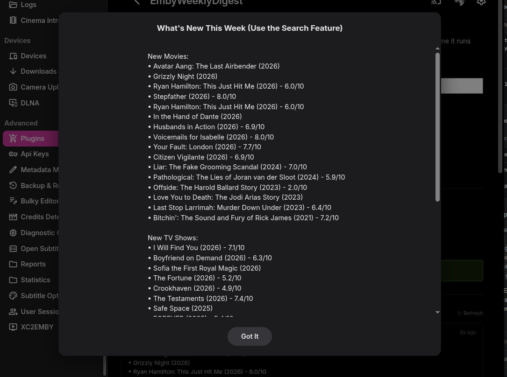
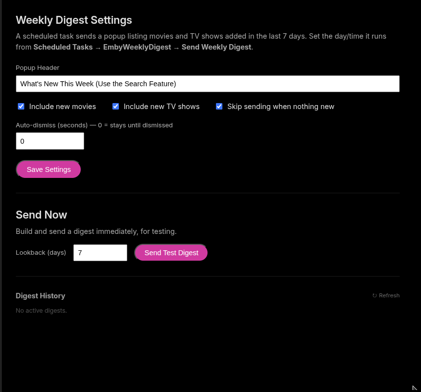
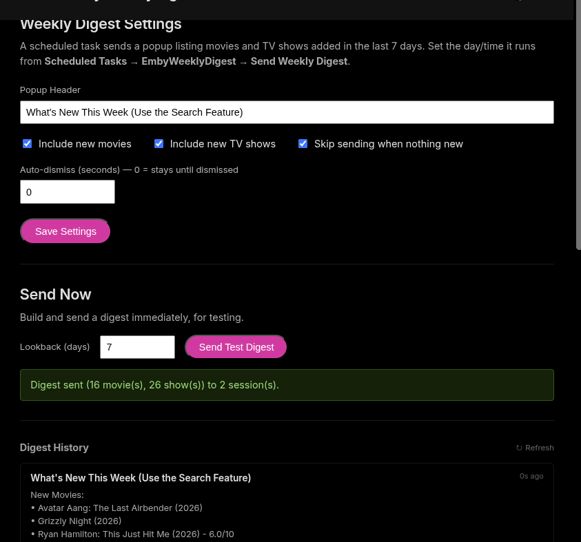

<p align="center">
  <h1 align="center">EmbyWeeklyDigest</h1>
</p>

<p align="center">
  An Emby Server plugin that sends a weekly popup digest of every movie and brand-new TV series added to your library — automatically, on a schedule.
</p>

<p align="center">
  
  
  
</p>

---

## What It Does

EmbyWeeklyDigest scans your library for everything added in the last 7 days and sends a popup (the same `MessageCommand` toast EmbyNotify uses) to every active session — no scripting, no cron jobs to babysit.

- **Movies** — every movie added in the lookback window.
- **New TV shows** — brand-new series only; a new episode of a show you already have doesn't trigger a mention.
- Each title shows its release year and, when available, its community rating (e.g. `Movie Title (2026) - 7.4/10`).
- TV shows are sorted by release year, newest first, and series older than 5 years are excluded by default to keep the list focused on what's actually new-to-you rather than decades-old library scans.
- Runs as a native Emby **Scheduled Task** (Dashboard → Scheduled Tasks → EmbyWeeklyDigest) — default trigger is Friday 6:00 PM, but you can change the day/time or run it on demand from Emby's own scheduling UI.
- **Deferred delivery** — if a user is offline when the digest goes out, they get it automatically the next time they log in.

---

## Screenshots

<p align="center">
  
</p>

<p align="center">
  
  
</p>

---

## Installation

### Step 1 — Get the DLL

**Option A: Download a release**

Download `EmbyWeeklyDigest.Plugin.dll` from the [latest release](../../releases/latest).

**Option B: Build from source**

Requires .NET SDK 8.0+.

```bash
git clone https://github.com/sftech13/EmbyWeeklyDigest.git
cd EmbyWeeklyDigest
dotnet build EmbyWeeklyDigest.Plugin/EmbyWeeklyDigest.Plugin.csproj -c Release
# Output: artifacts/bin/Release/netstandard2.0/EmbyWeeklyDigest.Plugin.dll
```

### Step 2 — Install

Copy the DLL to your Emby plugins directory and restart Emby.

**Linux (systemd)**
```bash
sudo cp EmbyWeeklyDigest.Plugin.dll /var/lib/emby/plugins/
sudo systemctl restart emby-server
```

**Docker**
```bash
docker cp EmbyWeeklyDigest.Plugin.dll emby:/config/plugins/
docker restart emby
```

### Step 3 — Open the Config Page

Go to **Emby Dashboard → Plugins → EmbyWeeklyDigest**.

---

## Usage

| Field | Description |
|---|---|
| **Header** | Popup title. Defaults to `What's New This Week`. |
| **Include Movies** | Toggle whether movies appear in the digest. |
| **Include TV Shows** | Toggle whether new series appear in the digest. |
| **Skip when empty** | Don't send anything if nothing new was added. |
| **Auto-dismiss timeout** | `0` = stays until dismissed; otherwise milliseconds before the popup auto-closes. |
| **Send Test Digest** | Builds and sends a digest immediately with a configurable lookback window, without waiting for the scheduled run. |

The config page also shows digest history with per-user delivery badges and a **Dismiss** control.

To change when the digest runs, go to **Dashboard → Scheduled Tasks → EmbyWeeklyDigest** — same place as any other Emby scheduled task.

---

## API

All endpoints require admin authentication (`?api_key=<key>` or a valid session token).

### `POST /EmbyWeeklyDigest/SendNow`

Builds and sends the digest immediately.

**Request body (JSON):**

```json
{ "LookbackDays": 7 }
```

### `GET /EmbyWeeklyDigest/Digests`

Returns sent digests with per-user delivery status.

### `DELETE /EmbyWeeklyDigest/Digests/{Id}`

Dismisses a digest.

---

## Building Releases

```bash
git tag v1.1.0
git push origin v1.1.0
```

---

## License

MIT
